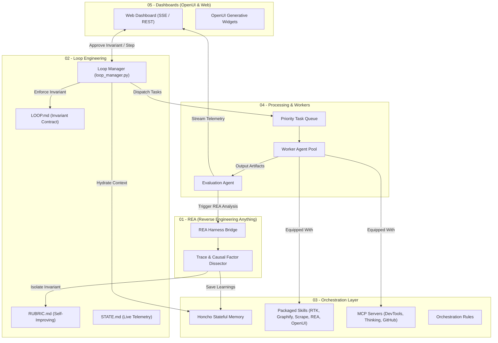

# System Architecture: Reverse Engineering Loop

## System Topology

```mermaid
flowchart TB
    subgraph UI ["05 - Dashboards (OpenUI & Web)"]
        WebDash["Web Dashboard (SSE / REST)"]
        OpenUIComp["OpenUI Generative Widgets"]
    end

    subgraph LoopEng ["02 - Loop Engineering"]
        LoopMgr["Loop Manager (loop_manager.py)"]
        LoopSpec["LOOP.md (Invariant Contract)"]
        Rubric["RUBRIC.md (Self-Improving)"]
        State["STATE.md (Live Telemetry)"]
    end

    subgraph Orch ["03 - Orchestration Layer"]
        HonchoMem["Honcho Stateful Memory"]
        SkillPack["Packaged Skills (RTK, Graphify, Scrape, REA, OpenUI)"]
        MCPServers["MCP Servers (DevTools, Thinking, GitHub)"]
        Rules["Orchestration Rules"]
    end

    subgraph Proc ["04 - Processing & Workers"]
        TaskQ["Priority Task Queue"]
        WorkerPool["Worker Agent Pool"]
        EvalAgent["Evaluation Agent"]
    end

    subgraph REAEngine ["01 - REA (Reverse Engineering Anything)"]
        REAHarness["REA Harness Bridge"]
        TraceAnalyzer["Trace & Causal Factor Dissector"]
    end

    WebDash <-->|Approve Invariant / Step| LoopMgr
    LoopMgr -->|Hydrate Context| HonchoMem
    LoopMgr -->|Enforce Invariant| LoopSpec
    LoopMgr -->|Dispatch Tasks| TaskQ
    TaskQ --> WorkerPool
    WorkerPool -->|Equipped With| SkillPack
    WorkerPool -->|Equipped With| MCPServers
    WorkerPool -->|Output Artifacts| EvalAgent
    EvalAgent -->|Trigger REA Analysis| REAHarness
    REAHarness --> TraceAnalyzer
    TraceAnalyzer -->|Isolate Invariant| Rubric
    TraceAnalyzer -->|Save Learnings| HonchoMem
    EvalAgent -->|Stream Telemetry| WebDash
```
